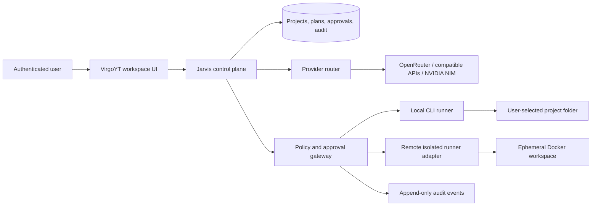

# VirgoYT AI Agent — Architecture and Trust Model

**VirgoYT AI Agent** extends Jarvis into a project-oriented development assistant. The initial release will help a signed-in user create plans, choose specialist agents, connect approved model providers, review proposed tool actions, and operate within a private workspace. It will not claim to be an unrestricted autonomous computer or silently take irreversible actions.

> **Core principle:** language models may propose work; only an authenticated user and a policy-controlled tool gateway may authorize its execution.

## Delivery Boundary

The current Vercel deployment is suitable for the **control plane**: the browser UI, authenticated API, project metadata, plans, approvals, audit records, and streaming model requests. It is not a safe runtime for arbitrary Docker containers, unbounded terminals, desktop browser automation, or per-user persistent operating systems. Those capabilities require a separately deployed **execution plane** with explicit resource isolation and a visible connection to the user’s workspace.

| Capability | First release | Execution boundary | Approval requirement |
| --- | --- | --- | --- |
| Chat, plans, task tree, memory | Implement in Jarvis control plane | User-scoped database rows | No approval to draft; user may delete/edit data |
| Specialist routing | Implement as transparent Coding, Research, UI, Security, and DevOps profiles | Server-side model router | No approval to plan; model selection is visible |
| Files and code proposals | Implement as diffs and an approval queue | Private workspace adapter | Explicit approval before any write/delete |
| Terminal commands | Propose and validate first | Local runner or isolated remote runner | Explicit approval per command or approved policy scope |
| Browser destinations | Prepare a named URL/action | User’s browser or isolated remote runner | Explicit approval before navigation or external action |
| Git operations | Draft branch, commit message, and patch | GitHub connection or local runner | Explicit approval before clone, commit, push, or pull request |
| Docker, packages, long-running jobs | Adapter contract and local CLI first | Dedicated isolated runner, not Vercel | Explicit approval, quotas, lifecycle limits |

## Target Architecture

The control plane never executes an arbitrary command merely because a model emits it. The agent loop produces structured tool proposals. The policy gateway classifies each proposal as **read-only**, **approval-required**, or **blocked**. An execution adapter accepts only an approval token that is bound to the user, project, exact action payload, expiry, and a single-use nonce.

## Control-Plane Domain Model

| Entity | Purpose | Sensitive fields or rules |
| --- | --- | --- |
| `agent_projects` | A user-owned development workspace record. | Every query is filtered by owner identity. |
| `agent_runs` | One assistant run with status, model profile, progress, and costs/usage metadata. | Never store provider secrets or hidden model reasoning. |
| `agent_plan_steps` | Ordered, reviewable work plan. | Each step links to run and project; status transitions are audited. |
| `tool_proposals` | Structured action candidate: tool kind, payload digest, risk level, and status. | Raw secrets are redacted before persistence; writes require a valid approval. |
| `tool_approvals` | User decision for a single immutable proposal. | Expiring, one-time use; bound to the authenticated owner. |
| `agent_audit_events` | Append-only user-visible timeline of requests, decisions, and execution results. | Store outputs after secret redaction; do not store chain-of-thought. |
| `provider_profiles` | User-visible provider configuration metadata. | Credential references only; encrypted credentials stay server-side or in user-local CLI config. |
| `runner_connections` | Paired local or remote runner registration. | No arbitrary inbound shell; mutual tokens are short-lived and revocable. |

## Provider and Memory Model

The first provider router supports the existing server-held OpenRouter configuration. It will expose adapter interfaces for OpenAI-compatible APIs, NVIDIA NIM, and a **local bridge** for a user’s own Ollama-compatible endpoint. The browser never receives a provider key. A user-managed key is encrypted only after an approved secure-storage implementation exists; until then, the UI links users to configure server-owned credentials or the local CLI.

Memory is divided into short-lived conversation context, project facts that users can review, and optional retrieval indexes. The initial product does not introduce embeddings until there is a clear user benefit and data-retention policy. Any retrieval record is scoped to one owner and project, with deletion and export pathways designed into the schema.

## Execution Plane Options

| Option | Best for | Trade-offs | Setup complexity |
| --- | --- | --- | --- |
| **Control plane plus local CLI** | Private coding projects, Termux, macOS, Linux, and Windows. | Uses the user’s machine and requires it to be online for execution; avoids a separate paid runner. | Moderate: user installs a CLI and explicitly connects a folder. |
| **Control plane plus isolated remote runner** | Containerized build/test environments and persistent project workspaces. | Requires a separately operated Linux host with Docker, quotas, network controls, and lifecycle cleanup. | Higher: remote runner registration, image policy, and operations are required. |

The product starts with the local CLI and a remote-runner protocol rather than representing Vercel as a virtual PC. A remote runner may later use short-lived isolated Docker workspaces. This matches established agent-server patterns: an isolated workspace manages container startup, readiness, and cleanup, while the host environment remains outside the agent container.[1] Action confirmation and security analysis remain distinct defense layers; user approval is not replaced by a model’s own risk assessment.[2]

## Phased Implementation

| Phase | Deliverable | Completion condition |
| --- | --- | --- |
| 1 | Control-plane foundation | Data model, protected tRPC contracts, agent-run state machine, audit timeline, and unit tests. |
| 2 | Workspace experience | Distinct Chat, Projects, Files, Terminal, Agents, and Settings UI areas with a visible plan/proposal queue. |
| 3 | Model adapters | OpenRouter profile plus interface stubs for compatible APIs, NIM, and local bridge; no client-side secrets. |
| 4 | Approval-gated tools | Proposal schemas for file, terminal, browser, Git, and deploy actions with explicit blocks for destructive/untrusted execution. |
| 5 | Local and remote adapters | Portable CLI scaffold and documented signed adapter protocol; Docker runner remains an operator-configured, isolated service. |
| 6 | Production hardening | Tests, mobile review, observability, documentation, and connection-specific activation steps. |

## Explicit Non-Goals for This Release

VirgoYT will not collect account passwords, bypass device locks or CAPTCHAs, evade bot detection, silently operate web accounts, send communications or payments without confirmation, expose user secrets to the client, or provide a covert persistent computer. A connected runner must be clearly labelled, user-owned or operator-owned, revocable, and governed by approval policies.

## References

[1] [OpenHands, “Docker Sandbox”](https://docs.openhands.dev/sdk/guides/agent-server/docker-sandbox)

[2] [OpenHands, “Security & Action Confirmation”](https://docs.openhands.dev/sdk/guides/security)
